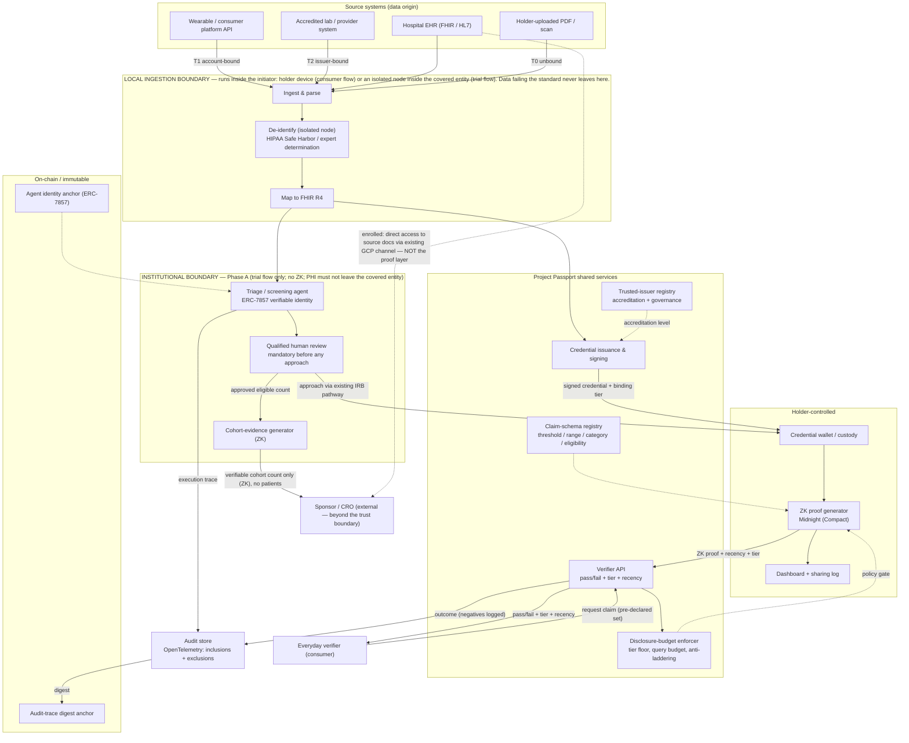
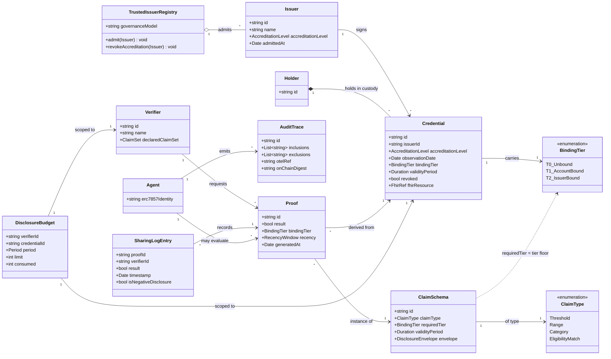
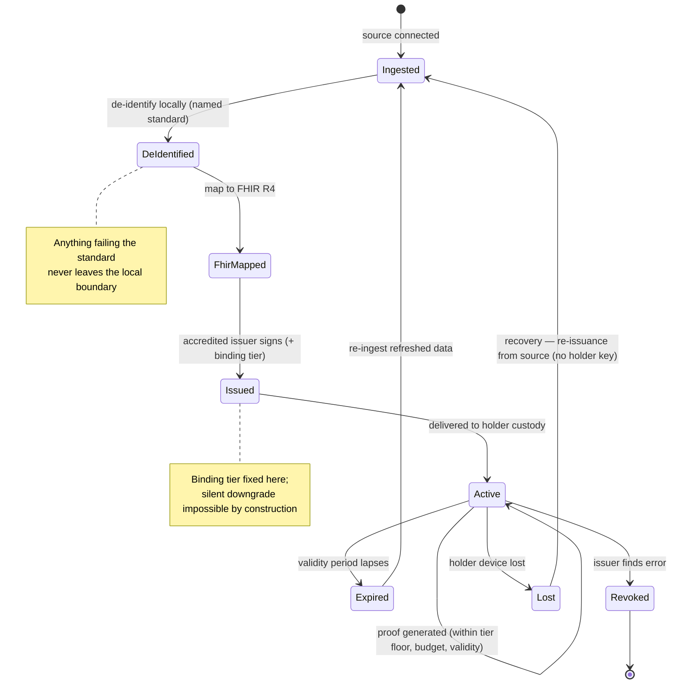
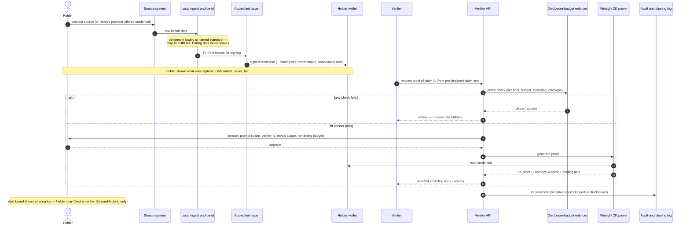
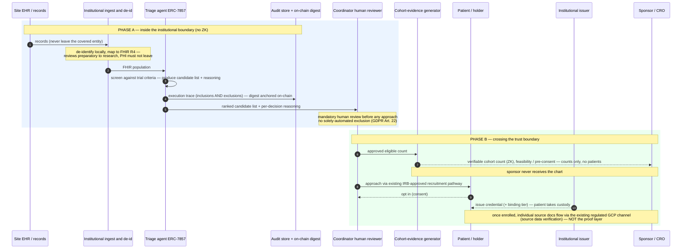
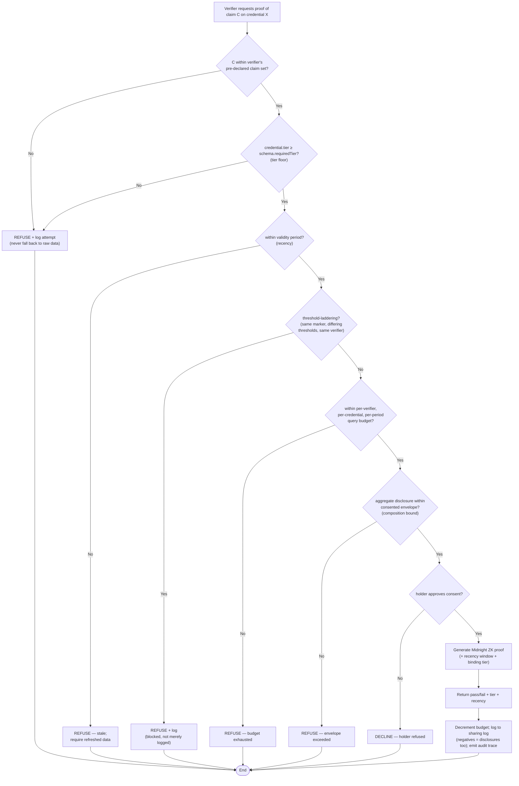
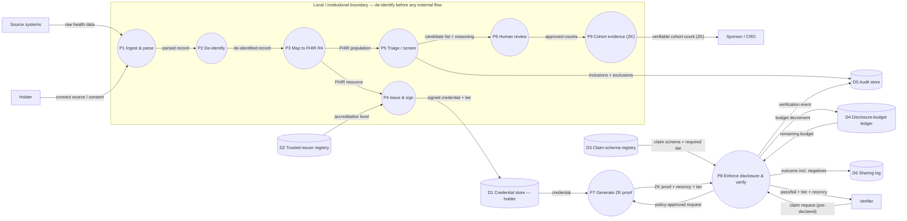

# Project Passport

**A verified health-credential layer.** WeOwnHealth's submission to the **Midnight Network Buildathon (Sep 2026)** — see [Roadmap](#roadmap-midnight-network-buildathon) for the wave plan.

Project Passport converts source health data — wearable exports, lab panels, scanned reports, clinical notes, hospital EHR records — into signed, patient-held credentials, and lets the holder generate a zero-knowledge proof of one specific claim from that credential without exposing the record behind it. Verifiers integrate once and receive a trustworthy pass/fail answer, never the underlying data.

> **Core thesis:** the hard, defensible problem is not the zero-knowledge proof — that technology is available and increasingly commoditised. The hard problem is **issuer trust**: getting reputable labs, wearables and health systems to sign credentials, and establishing how strongly each credential is bound to a specific person. Coverage and issuer accreditation are the moat, in the same way that bank coverage — not the API — is Plaid's moat. The product plan is organised around that, not around the cryptography.

## Table of Contents

- [Overview](#overview)
- [Problem Statement](#problem-statement)
- [Current State of Affairs](#current-state-of-affairs)
- [Solution](#solution)
- [Architecture](#architecture-resolving-the-two-flow-contradiction)
- [Architecture Diagrams](#architecture-diagrams)
- [User Stories](#user-stories)
- [Requirements](#requirements)
- [Experimentation Questions](#experimentation-questions)
- [Acceptance Criteria & Success Metrics](#acceptance-criteria-and-success-metrics)
- [Commercial Model](#commercial-model)
- [Assumptions & Risks](#assumptions-and-risks)
- [Out of Scope for v1](#explicitly-out-of-scope-for-v1)
- [Potential Improvements](#potential-improvements-for-later)
- [Repository Structure](#repository-structure)
- [Getting Started](#getting-started)
- [Roadmap (Midnight Network Buildathon)](#roadmap-midnight-network-buildathon)

## Overview

The product spans two flows that share an ingestion pipeline and a proof layer but differ in who initiates:

- **Consumer flow** — holder-initiated. The patient collects credentials and proves claims on demand across many everyday verifiers.
- **Clinical-trial flow (Passport)** — institution-initiated throughout. The site screens its own population, evidences verifiable cohort counts to a sponsor before consent, and issues credentials to patients who opt in. It adds a verifiable AI agent layer so automated triage decisions are attributable and auditable, and it feeds the consumer flow by putting credentials in patients' hands.

## Problem Statement

**Primary persona — the credential holder**
A patient or individual with health data held across labs, wearables and provider systems is trying to prove a single specific health fact to a third party so they can access a trial, a policy, a benefit or a service — without taking on unnecessary exposure. Today their only options are to hand over an entire record (dozens of markers plus identifying information) to get one fact verified, or to assert the fact unverifiably and be disbelieved.

**Secondary persona — the verifier (clinical trial sponsor / CRO / site coordinator)**
A trial coordinator, sponsor or CRO is trying to identify and confirm eligible participants at speed so the trial enrols on schedule. Manual chart review is slow, and routing raw records to external AI tooling for automated screening creates HIPAA/GDPR exposure the institution will not accept — so screening stays a human bottleneck.

**Tertiary persona — the issuing institution**
A hospital, laboratory or diagnostics provider is trying to let its patients act on their own data elsewhere so it meets interoperability and patient-access obligations. Every external disclosure it enables is a liability it retains, so its default is to release data only in bulk to the patient and nothing to anyone else.

## Current State of Affairs

- Individuals export PDFs or screenshots and send the whole file to whoever asked, because there is no mechanism to disclose one field. Full exposure for a single fact is the normal, accepted behaviour.
- Where full disclosure is impractical, verifiers accept self-reported claims with no verification path, which invites misreporting and devalues the claim for everyone.
- Trial screening is dominated by manual chart review. EHR-native cohort tools match on structured fields and handle unstructured notes poorly; tools that read notes well generally require records to leave the institutional boundary, which compliance blocks. The gap is unstructured-data screening that stays inside.
- Recruitment underperformance is the accepted baseline (commonly cited: ~80% of trials miss initial enrolment targets/timelines — though at least one Tufts CSDD sample found meaningfully better and improving results). This should not be the sole basis for the business case.
- No reusable credential layer exists, so every relationship (each insurer, employer, trial, platform) requires its own fresh, all-or-nothing disclosure that can't be reused elsewhere.

## Solution

Our verified health-credential platform helps patients and the institutions that hold their data prove specific health claims to any verifier by:

1. Ingesting source data through **local de-identification** into **FHIR-mapped credentials**, signed by an accredited issuer, each carrying an explicit **binding tier** stating how strongly it is tied to a person.
2. Generating a **Midnight zero-knowledge proof** of one claim at a time — carrying its own recency and binding tier — which a verifier's API or AI agent evaluates with a fully attributable audit trail.

Holders reuse one verified health identity across every context that needs it; verifiers get answers they can defend to their own auditors, without ever holding the underlying medical data.

## Architecture

The first draft treated consumer and clinical-trial flows as one architecture. They are not — the consumer flow assumes a population that already holds credentials and initiates proofs; the trial flow assumes an agent scanning a hospital's records to find patients who, by definition, hold no credential yet. Left unresolved, this is a cold-start failure.

**Resolution:** place the zero-knowledge boundary where the trust boundary actually is — between the institution and the external sponsor, not inside the institution.

### Phase A — inside the institutional boundary

- Records are ingested, parsed and mapped to **FHIR R4** locally. De-identification to the chosen standard runs on an isolated node before any external routing.
- A **triage agent** screens the population against trial criteria and produces a candidate list — a research activity, not treatment or operations.
- **Lawful pathway:** HIPAA's "reviews preparatory to research" provision permits an institution's own workforce to review PHI to identify potentially eligible patients, but PHI may not leave the covered entity, and a non-workforce researcher (i.e. Project Passport) cannot use it on this basis at all without an IRB waiver plus executed agreements. So either the screening agent ships as **software the institution deploys and operates itself**, or every site becomes a waiver-and-agreement negotiation measured in months. This is a product-form decision made before engineering starts.
- The agent operates under a **verifiable identity (ERC-7857)** and emits an **immutable execution trace** covering inclusions and exclusions.
- A **qualified human reviews** the candidate list before any patient is approached — a hard requirement, not a convenience.

### Phase B — crossing the boundary

Sponsors never receive the chart. Under ICH GCP, a subject's source data is linked to the sponsor's database only by a subject identification number, with the key retained at the site — monitors, auditors and inspectors are granted direct access to source records during monitoring/inspection. A zero-knowledge proof cannot substitute for source documentation there.

Where the proof does real, defensible work — earlier in the process, against a different problem:

- **Pre-consent screening confirmation** — a site evidences to a sponsor that a named number of eligible patients exist before consent/authorisation. Today this is a claim taken on trust.
- **Multi-site feasibility** — a sponsor selecting sites obtains verifiable cohort counts across institutions without any site disclosing patients or its population to competitors.
- **Cross-institution deduplication** — detecting the same patient enrolled at two sites without either site disclosing who its patients are.

**Not defensible:** post-enrolment eligibility verification. That's governed by source data verification and stays out of scope.

**Phase B mechanics**

- Candidates are approached through the institution's existing, IRB-approved recruitment pathway.
- A patient who opts in is issued a credential carrying its binding tier and takes custody of it.
- Aggregate, verifiable cohort evidence is shared with the sponsor at feasibility/screening; individual source documentation continues to flow through the existing regulated channel once a subject is enrolled.

This makes the consumer flow the natural downstream effect rather than a parallel product: every patient issued a credential during Phase B is a holder who can use it elsewhere. **Trial recruitment becomes the credential-distribution channel.**

## Architecture Diagrams

All diagrams below are rendered from source (Mermaid) and encode the invariants stated in the spec. The load-bearing ones — the trust boundary sits **between institution and sponsor** (not inside the institution); the **tier floor** is enforced by construction; **post-enrolment source documents never traverse the proof layer** — are called out beneath each diagram.

**Notation key**

- **UML component / deployment** — structural view of components grouped by trust zone (subgraphs are trust boundaries).
- **UML class diagram** — the domain model: entities, attributes, and relationships.
- **UML state machine** — the credential lifecycle.
- **UML sequence** — ordered message exchange for each flow.
- **UML activity** — the disclosure-control decision logic.
- **Data flow diagram (DFD, Level 1)** — processes `(( ))`, data stores `[( )]`, external entities `[ ]`, and the data that moves between them.

### 1. Component & Trust-Boundary Diagram (UML)

The single most important structural fact: the zero-knowledge boundary is drawn where the trust boundary actually is — between the institution and the external sponsor. De-identification runs **inside** the initiator's local boundary before anything is routed externally.



> **Encoded invariants:** only ZK-derived, patient-free evidence crosses the institutional boundary to the sponsor; source documents for enrolled subjects reach the sponsor through the existing regulated GCP channel (dashed), never through the proof layer; the triage agent carries an ERC-7857 identity and its trace is anchored on-chain.

### 2. Domain Model (UML class diagram)



> **Encoded invariants:** `bindingTier` is an attribute of `Credential` (set once at issuance), while `requiredTier` is an attribute of `ClaimSchema` — the tier floor is the relation `credential.bindingTier ≥ schema.requiredTier`; a `DisclosureBudget` is scoped to the *pair* (`Verifier`, `Credential`); a `SharingLogEntry` records negative results explicitly (`isNegativeDisclosure`).

### 3. Credential Lifecycle (UML state machine)



> **Encoded invariants:** recovery after device loss routes back through the source (re-issuance), never through holder-retained key material; an expired credential cannot produce proofs until refreshed data is re-ingested.

### 4. Consumer Flow (UML sequence — holder-initiated)



> **Encoded invariants:** the policy gate runs *before* any proof is generated; a refused request never falls back to raw-data disclosure; the verifier receives only pass/fail + tier + recency.

### 5. Clinical-Trial Flow (UML sequence — Phase A & Phase B)



> **Encoded invariants:** screening is a *research* activity inside the covered entity; exclusions are logged (an unlogged exclusion cannot be contested); a human review step gates every approach; only aggregate ZK cohort counts cross to the sponsor pre-consent; enrolled-subject source verification stays on the existing GCP channel.

### 6. Proof Request & Disclosure Control (UML activity)

The disclosure-control gate is the spec's most scrutinised area — a naïve design lets a verifier binary-search a value across a series of individually reasonable questions. Every refusal path terminates without raw-data fallback.



> **Encoded invariants:** the tier floor is checked before generation (impossible by construction, not convention); threshold-laddering is *blocked*, not merely logged; the query budget is countable and enforced per (verifier, credential, period).

### 7. Data Flow Diagram (DFD — Level 1)



> **Encoded invariants:** no raw or under-de-identified data flows out of the local boundary (P2 gates every external arrow); the only sponsor-bound flow is the ZK cohort count from P9; verification (P8) reads the budget ledger and writes back a decrement, so the per-period ceiling is enforced, not merely observed.

## User Stories

### Credential holder

1. The holder connects a source (wearable account, lab portal, uploaded report) or receives a credential offered by their provider during a clinical encounter.
2. The system parses and de-identifies locally, maps to a standard record format, and issues a signed credential carrying its binding tier. The holder sees plainly what was captured, what was discarded, which issuer stands behind it, and how strongly it is tied to them.
3. A verifier requests proof of one claim. The holder sees the exact claim being asked for, the verifier's identity, and what the proof will/won't reveal, before deciding.
4. The holder generates the proof in seconds and shares only that. The verifier sees a pass/fail result, the issuer's accreditation level, the credential's binding tier, and data recency.
5. The holder keeps a complete log of every claim shared, with whom and when, and can block future proof generation for any verifier — with clear notice that blocking is forward-looking only.

### Trial coordinator

1. The site connects its records pipeline; ingestion and de-identification run entirely inside the institutional boundary.
2. The triage agent returns a ranked candidate list with reasoning for each inclusion/exclusion, reviewed by a qualified human before anyone is approached.
3. The site evidences verifiable eligible-cohort counts to a sponsor at the feasibility stage without disclosing patients.
4. The coordinator approaches candidates through the existing approved recruitment pathway; patients who opt in are issued credentials and enter the trial through the normal regulated process.

## Requirements

### Functional Requirements

**Ingestion and issuance**

- Ingest from at least one structured API source (wearable or lab) and one unstructured document source (PDF/scan) per pilot.
- De-identify locally to a **named standard** before any data leaves the ingestion node or reaches an external API/model (HIPAA Safe Harbor removal of all 18 identifier categories, or a documented expert determination of very small re-identification risk — "redact PII/PHI" is not a standard and not auditable).
- Where the pipeline cannot reach the chosen standard for a given data type, say so explicitly and keep that data inside the institutional boundary rather than weakening the standard.
- Map ingested data to **FHIR R4** resources.
- Issue a signed credential carrying, at minimum: issuer identity and accreditation level, observation date, and binding tier achieved.

**Identity binding and issuer trust**

Binding strength is an attribute of the credential, not a universal gate — a wearable account has no identity proofing at all, and only a supervised draw at an accredited laboratory approaches full binding.

| Binding tier | What it means | What a verifier should infer |
|---|---|---|
| **T0 — Unbound** | Holder-uploaded document or image; no issuer signature, no identity proofing | Treat as self-attestation with a legible source. Not evidence. |
| **T1 — Account-bound** | Pulled via authenticated API from a wearable/consumer platform; bound to an account, not a person | Data is authentic to the device/account. Nothing rules out another person having generated it. |
| **T2 — Issuer-bound** | Signed by an accredited laboratory or provider; identity proofed at or near collection | The result belongs to the named holder. Suitable for consequential decisions. |

- Carry the binding tier inside every credential and surface it on every proof, so verifiers set their own floor.
- Maintain a **trusted-issuer registry** with defined accreditation criteria, an admission process, and a published governance model.
- Support issuer-initiated credential revocation where a source discovers an error, with verifiers able to check current validity.
- Never allow a T0/T1 credential to satisfy a claim a verifier has marked as requiring T2 — silent tier downgrade must be impossible **by construction**, not by convention.

**Proof and verification**

- Generate a **Midnight (Compact)** zero-knowledge proof for a defined claim type: threshold, range, category, or eligibility match.
- Carry a recency attestation inside the proof — a coarse validity window rather than an exact date.
- Enforce per-claim validity periods set by the issuer or claim schema; expired data blocks new proof generation without a refresh.
- Provide a verifier API returning pass/fail plus binding tier and recency, with no access to underlying data.

**Disclosure control across repeated proofs**

A single proof reveals one bit, but a sequence of proofs against the same credential can reveal the underlying value (threshold-laddering / binary search), and a negative result is itself a disclosure.

- Enforce a per-verifier query budget per credential per period, visible to the holder before they approve the first proof.
- Detect and **block** threshold-laddering (repeated proofs of the same marker at differing thresholds from one verifier) — not merely log it.
- Treat claim schemas as composable disclosures and bound what a given verifier may learn in aggregate.
- Require verifiers to pre-declare the claim set they intend to request, so the holder consents to a defined disclosure envelope.
- Surface negative results to the holder as disclosures in their own right in the sharing log.

**Agentic layer**

- Assign a **verifiable agent identity (ERC-7857)** to any agent performing automated claim or eligibility evaluation.
- Emit an **immutable execution trace** (OpenTelemetry to an audit store, digest anchored on-chain) capturing inclusions and, critically, exclusions.

**Holder control and recovery**

- Give the holder a dashboard of active credentials, claims shared, recipients, and timestamps.
- Allow the holder to block future proof generation for a named verifier, with the forward-looking limits stated in the interface.
- Provide a credential recovery path that does not depend on the holder retaining a key (re-issuance from the original source is the preferred mechanism).

### Non-Functional Requirements

- No data failing the chosen de-identification standard is transmitted to any external service, including model APIs, at any stage of ingestion, screening or matching.
- Proof generation and verification complete within a few seconds on a mid-range mobile device, including under intermittent connectivity.
- Every flow auditable end to end without the audit trail being reversible into the source record.
- Compliant with HIPAA and GDPR for institution-sourced data, including a defined stance on Business Associate vs. processor status, and an explicit Article 9 lawful basis for special-category data.
- Verifier integration effort comparable to a standard identity-verification API — measured, not asserted.
- Source-agnostic: adding a lab, wearable or EHR system must not require changes to the claim or proof layer.
- Clinical-trial workflows fit within existing IRB-approved recruitment processes.
- **No solely automated decision may determine a person's access to a trial** (GDPR Art. 22) — meaningful human review before a candidate is dropped, a retained reason for each exclusion, and a contestable record.
- Availability and graceful degradation: a failed proof generation must never fall back to raw-data disclosure, at any layer.

## Experimentation Questions

**Demand-side — the load-bearing uncertainty**

- Will a verifier genuinely accept a proof in place of the data it currently collects? For regulated trials this is already answered (no) — treat that as the base rate when testing other verticals.
- Which claim commands the clearest willingness to pay: trial eligibility, life/disability underwriting, or a consumer verification use case?
- What evidence would a sponsor or CRO need before acting on an agent-produced shortlist without independently re-verifying every match?

**Supply-side**

- What does it actually take to get the first accredited issuer to sign credentials, and what liability will they demand be allocated elsewhere?
- Which side of the network is more supply-constrained at cold start — issuers or verifiers — and which must be seeded first?

**Holder-side**

- Do holders trust a de-identification pipeline they cannot inspect, or do they require visible confirmation of what was removed?
- How much friction in issuance is tolerable before drop-off, particularly when the credential is offered during a clinical encounter?
- Does holder-mediated disclosure change what people are willing to share at all, or does it simply relocate the same pressure to disclose?

## Acceptance Criteria and Success Metrics

Requirements state what the product must eventually do. Acceptance criteria state what must be true to **ship the first version**.

### v1 acceptance criteria — must be true to ship

- A holder can connect at least one source and receive a signed credential, with the binding tier explicitly recorded, and nothing failing the chosen de-identification standard leaves the local ingestion environment (verified by network-level packet inspection, not code review).
- A holder can generate a valid proof for at least one claim type and share only that proof with a verifier endpoint.
- A verifier can call the API and receive a correct pass/fail plus binding tier and recency, with no access to underlying data.
- A tier floor is enforced: a T2-required request cannot be satisfied by a T0/T1 credential (demonstrated by a failing test case).
- A repeated threshold-laddering attempt from one verifier against one credential is refused, demonstrated live.
- One agent-produced screening decision yields a verifiable agent identity and a reviewable trail covering inclusion and at least one exclusion, with a human review step present.
- A holder can view a disclosure log that records negative results as disclosures, and can block a named verifier from future proof generation.
- The end-to-end flow runs live with no manual step that bypasses de-identification, tier recording, or the proof layer.

### Deferred beyond first release — required, not yet gating

- Credential recovery after total device loss without holder-retained key material.
- Trusted-issuer registry with live accreditation governance and more than one admitted issuer.
- Identity proofing at point of collection for T2 credentials in production conditions.
- Issuer-initiated revocation with verifier-side validity checking.
- Cross-claim disclosure envelopes negotiated per verifier rather than per request.

### Success metrics (targets set before the build)

| Metric | Target | Why it matters |
|---|---|---|
| Accredited issuers admitted and signing | At least one named T2 issuer before pilot; growth is the primary business metric | This is the moat |
| Proof generation latency (mid-range mobile) | Under 5 seconds, p95 | Above this, holders abandon mid-flow |
| Source-to-credential completion rate | Set baseline in pilot; track drop-off by step | Identifies where issuance actually fails |
| Verifier integration time | Under one engineering day to first successful call | Determines whether the network can compound |
| Agent screening recall | Measured against blinded manual chart review on a sampled subset | A missed eligible patient is invisible and uncorrectable |
| Agent screening precision | Secondary; coordinator review absorbs false positives | False positives cost review time, not outcomes |
| Proportion of raw-data fallbacks | Zero | Any fallback path invalidates the entire premise |
| Proofs answered per verifier per credential per period | Hard ceiling set per claim schema; breaches alert rather than log | A countable ceiling is the only testable version of the privacy claim |

## Commercial Model

### Where value is captured

Splitting the trial flow into Phase A and Phase B was the right architectural call, but almost all the labour saving lands in Phase A (replacing manual chart review inside the institution), while Phase B — where the distinctive technology lives — is a thin confirmation step at the end. Charging the sponsor for Phase B while handing the institution Phase A for free monetises the less valuable half.

Three ways out — one must be chosen deliberately:

1. **Sell Phase A** to institutions as a screening product — real revenue, but a crowded market where the ZK layer contributes nothing to the moat.
2. **Sell verifiable cohort evidence** at the feasibility/site-selection stage — where the proof does defensible work now that post-enrolment verification is ruled out.
3. **Bundle** — Phase A as the free wedge that drives credential issuance, treating the credential population as the asset being built. Most coherent with the network thesis; most demanding of runway.

### Regulatory constraints on the original revenue lines

- **ACA:** insurers in individual/small-group markets may vary premiums on only four factors (coverage type, geography, age, tobacco use). Health status, pre-existing conditions and claims history are prohibited — a per-check underwriting fee for health insurance has no lawful buyer in that market.
- **GINA** bars health plans from using genetic information for underwriting and restricts employer use of it; the **ADA** independently constrains employer medical inquiries. Employer wellness is a narrow, heavily conditioned channel.
- GINA's protections don't extend to **life, disability or long-term care insurance**, where medical underwriting remains standard — this is the viable insurance vertical.
- Jurisdiction changes the answer materially (e.g. Nigeria's NDPA vs. EU GDPR) — a non-US launch market is a strategic choice, not a default.

### Revised priority order

1. Feasibility and site-selection evidence sold to sponsors/CROs (verifiable cohort counts before consent).
2. Issuer integration fees from labs and health systems seeking preferred-issuer status.
3. Agent-audit-as-a-service, sold independently of claim type.
4. Life, disability and long-term care underwriting.
5. Consumer freemium.
6. Enterprise volume agreements once issuance is proven.

*Notably absent: per-verification eligibility fees, which earlier drafts ranked first and which GCP forecloses.*

## Assumptions and Risks

| Assumption | If it fails | How we test it early |
|---|---|---|
| Verifiers will accept a proof instead of the underlying record | The product has no market in its current form | Structured interviews with compliance/audit functions, not product teams, before build |
| Accredited issuers will sign credentials | No trustworthy credentials exist; only self-attested ones | Secure one named issuer commitment before the pilot begins |
| Identity can be bound reliably at or near collection | Credentials become transferable and the proof is worthless | Prototype the binding mechanism against a real collection workflow |
| Institutions will permit agentic screening inside their boundary | Phase A is blocked and the trial vertical stalls | Single-site legal and IRB review before engineering |
| Holders will manage credentials over time | Credentials go stale and verifiers stop trusting them | Measure refresh behaviour, not just first issuance |
| Someone will pay for Phase B rather than only Phase A | The distinctive technology is the unmonetised half of the product | Price-test feasibility-stage cohort evidence with a sponsor before build |
| Feasibility/site selection is a real budget line sponsors will spend against | The trial vertical has no buyer once post-enrolment verification is ruled out | Confirm with a CRO which budget this comes from, and whose signature releases it |
| Disclosure budgets are commercially acceptable to verifiers | Verifiers route around limits or churn; the privacy claim weakens | Put the query budget in front of a verifier in the first sales conversation |

### Named risks

- **Verifier-side liability displacement** — verifiers may resist a model that leaves them without the record they'd rely on to defend a decision; anticipate demand for indemnification.
- **Regulatory drift** — the legal position differs by jurisdiction and line of business, and is actively moving. Treat legal review as a recurring workstream.
- **Ethical exposure of consumer verticals** — a consumer health badge is only meaningful for decision-relevant claims, and decision-relevant claims in intimate contexts carry discrimination/disclosure implications.
- **Cryptographic commoditisation** — the ZK layer is the least defensible component; if issuer coverage doesn't accumulate, a better-capitalised entrant reproduces the product.
- **Institutional deployment friction** — if the screening agent must run as institution-operated software, the product form is enterprise software with an enterprise sales cycle, not a service.
- **Disclosure-budget arbitrage** — a verifier blocked from laddering directly may attempt the same inference across multiple credentials, related accounts, or longer periods. Budgets set the floor of the defence, not its ceiling.
- **Reviewer scrutiny** — a privacy-first product that cannot answer the composition-leakage question in one sentence will lose credibility with the technical audience it most needs.

## Explicitly Out of Scope for v1

- Post-enrolment eligibility verification for regulated trials (governed by GCP source data verification).
- Posthumous and cause-of-death claims (require a distinct authority model — the holder cannot consent).
- Hereditary and genetic risk claims (highest regulatory load, lowest lawful-buyer availability).
- Consumer verification verticals such as dating platforms (deferred, retained on the roadmap).
- Multi-issuer credential aggregation and cross-source claim composition.
- Any general-purpose health data marketplace — the product is a credential layer, and conflating the two destroys the trust position it depends on.

## Potential Improvements for Later

- Expand the claim catalogue to hereditary risk and posthumous claims once the authority and consent models are designed properly.
- Verifier subscription tiers for standing feature availability rather than per-check pricing.
- Preferred-issuer programme with published accreditation tiers, turning issuer coverage into a visible competitive asset.
- Consumer freemium with premium tiers for advanced claims and family plans.
- Extend the agentic audit layer to underwriting and benefits-decisioning agents, each with its own verifiable identity and trace — potentially a standalone product.
- Cross-jurisdiction credential portability.
- Enterprise volume agreements with large insurers and health systems once the issuance pipeline and first vertical are proven.

## Repository Structure

A pnpm + Turborepo monorepo. Every backend service maps to a specific box in the [Component & Trust-Boundary diagram](#1-component--trust-boundary-diagram-uml) and a specific process in the [Data Flow Diagram](#7-data-flow-diagram-dfd--level-1) — see each package's own `README.md` for exactly which one, and for what's real versus stubbed.

```
apps/
  holder-web/            Holder dashboard, credentials, consent, sharing log
  coordinator-console/   Phase A human-review UI (the GDPR Art. 22 gate)

services/
  ingestion/              P1 — pulls from source systems
  deid/                   P2 — de-identifies locally, before anything leaves the boundary
  fhir-mapper/            P3 — maps to FHIR R4
  issuance/               P4 — signs and issues credentials
  issuer-registry/        D2 — trusted-issuer registry & governance
  claim-schema-registry/  D3 — claim schema definitions
  disclosure-guard/       P8 — tier floor, recency, anti-laddering, budget, envelope (real decision logic + tests)
  verifier-api/           the one endpoint verifiers call
  triage-agent/           P5 — Phase A screening, inclusion/exclusion reasoning (real logic + tests)
  audit/                  D5 — hash-chained, tamper-evident event log (real logic + tests)

packages/
  shared-types/    the domain model — mirrors the class diagram exactly
  service-kit/     shared Fastify bootstrap (logging, health checks)

contracts/
  midnight/    THE proof layer, and now the only chain in this repo — Compact circuits for the
               four claim types, compiled against the real toolchain. An earlier contracts/evm/
               package (agent identity, audit-digest anchoring) was removed entirely to avoid
               assuming an EVM chain ahead of a team decision on either mechanism — see
               services/audit/README.md and packages/shared-types/src/agent.ts.

infra/         docker-compose services (Postgres, Redis, OTel collector, Midnight proof server)
```

## Getting Started

```bash
corepack enable   # if you don't already have pnpm
pnpm install
cp .env.example .env

docker compose up -d postgres redis otel-collector

pnpm build
pnpm test
pnpm dev          # starts every app/service in parallel via Turborepo
```

Contracts are a separate toolchain, not part of `pnpm dev`:

```bash
# Midnight (Compact) — see contracts/midnight/README.md for install
pnpm --filter @passport/contracts-midnight compile
```

### What's real versus scaffolded

This is a first-pass scaffold, not a finished system. Concretely real and tested: `disclosure-guard`'s policy engine (the tier-floor/anti-laddering/budget logic), `triage-agent`'s screening + human-review gate, `audit`'s hash chain, and all four Compact circuits (compiled). Concretely stubbed, with `TODO(passport)` markers at each spot: the Midnight prover isn't wired into `verifier-api`, credential signing isn't implemented in `issuance`, and every datastore is in-memory pending a real Postgres/Redis integration. **Deliberately not scaffolded at all:** the agent-identity/verification mechanism (ERC-7857 per spec, or otherwise) — `AuditTrace.agentIdentity` is a plain, unverified string — and the on-chain audit-digest anchor. Both had EVM (Solidity/Foundry) implementations at one point; both were removed rather than leaving the codebase committed to a chain nobody had actually agreed to. See `packages/shared-types/src/agent.ts` and `services/audit/README.md` for the reasoning and how to pick either back up. Each service's own `README.md` says which category it's in — read that before assuming a route does more than it does.

## Roadmap (Midnight Network Buildathon)

This repository is WeOwnHealth's submission to the **Midnight Network Buildathon (Sep 2026)**. The wave plan below is carried over from the original buildathon submission and is the forward plan for this repo, now built on the Passport-standard codebase described throughout this README rather than the earlier Wave 1 scaffold.

### Wave 1 — done, and exceeded

The original Wave 1 scope was: a 2-circuit Compact contract (issue + prove), a single hardcoded trial ("cholesterol at or below 200 mg/dL"), mock lab data, a wallet-pull delivery pattern, and a demo frontend with a patient/sponsor role switcher.

The unified codebase now in this repo exceeds that scope on every point: **four** Compact circuits (not two — threshold, range, category, and eligibility match, covering all four claim types in the spec), a full backend of ten services mapped 1:1 to the architecture's [Data Flow Diagram](#7-data-flow-diagram-dfd--level-1), real (not mocked) disclosure-budget/tier-floor/anti-laddering logic with its own test suite, and two working Next.js apps — one of which (`coordinator-console`) already implements the GDPR Art. 22 human-review gate end-to-end.

### Wave 2 (Sep 27 – Oct 17)

- Credential revocation circuits
- Split backend into Attestation Service + separate OCC (Off-Chain Coordinator)
- WebSocket push notifications
- FHIR standardization pipeline
- ClinicalTrials.gov API integration
- Additional verifier UIs (insurance, employer, etc.)

### Wave 3 (Oct 27 – Nov 16)

- AI Triage Agent + ERC-7857 verifiable identity
- PII redaction (local LLM)
- Real lab/wearable integrations (Function, Quest, Whoop, Oura)
- SigNoz + OpenTelemetry observability

> **Note on ERC-7857:** agent-identity implementation was deliberately rolled back, and the EVM chain it lived on (`contracts/evm`) has since been removed entirely — see `packages/shared-types/src/agent.ts`. Wave 3's ERC-7857 item is the natural place to pick that decision back up, once the team has actually agreed on an approach (ERC-7857 on a new EVM chain, a Midnight-native scheme, or otherwise) rather than it being assumed by scaffolding.

### Team

Built by WeOwnHealth for the Midnight Network Buildathon (Sep 2026).

---

*Working name: Project Passport. This README reflects the current product spec; implementation is in progress.*
